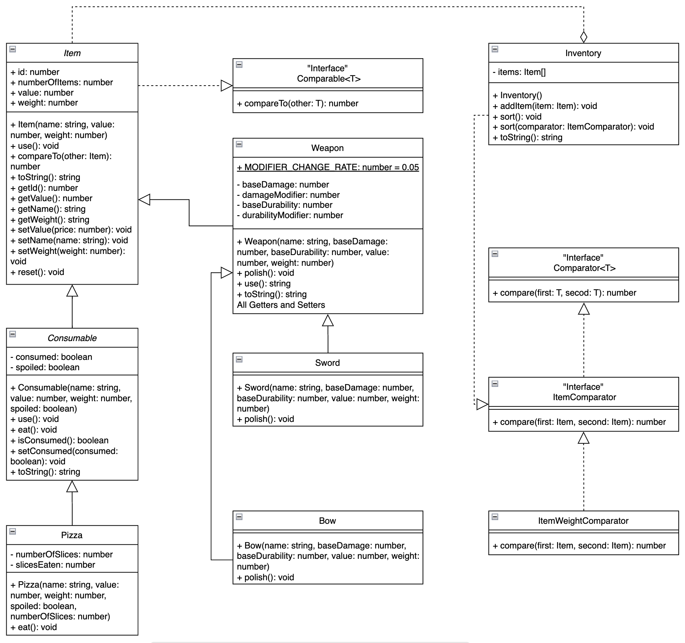

# 6. 📚 Home Task

import { TableForMentors } from '@site/src/components';

The home task should be done using TypeScript.

:::info
The starter code for the home task is located in _docs/3-building-blocks-of-oop-part-2/hometask_ folder
:::

Check the UML representation of a set of classes that represent the inventory and various types of items.

The classes and methods in italics are abstract. The concrete child classes must implement all methods from the abstract parent classes.

The line from `Item` to `Comparable` indicates that `Item` must implement the `Comparable` interface. Similarly, the `ItemWeightComparator` class must implement the `ItemComparator` interface, which extends the `Comparator` interface.



## Specific Steps

### Item

The `Item` class is the common ancestor to the various types of items.

- All instances of `Item` should be given a unique id number. It has to be assigned in the constructor. The first instance of an item should be assigned an id of 1; the next should be assigned an id of 2, etc.

- `compareTo(other: Item)`: The `Item` class implements the `Comparable` interface. This requires adding the `compareTo(other: Item)` method to the class. The `compareTo(other: Item)` method takes in another instance of `Item` and compares it to the current instance. If the current instance's value field is greater than other's value field then the method should return 1. If the current instance's value field is less than other's value field then the method should return a -1. If both items are equal, then compare the name field of the items lexicographically (meaning, compare each character in the strings based on its value, ignoring case. i.e. `A` would equal to  `a`), returning the appropriate value. 0 should be returned if name fields are equal.
- `toString()`: for an `Item` with the name of "ring", a value of 3000, and a weight of 0.013, the method should return a string in the following format:

  ```
  "ring − Value: 3000, Weight: 0.01"
  ```

### ItemWeightComparator

The `ItemWeightComparator` class implements the `ItemComparator` interface, meaning instances of it can be passed to methods requiring a comparator for objects of type `Item`.

- `compare(first: Item, second: Item)`: should function similarly to the `compareTo(other: Item)` method of the `Item` class, but for the weight field of the `Item`. If the weights are equal, this method should call the `compareTo(other: Item)` method of the first `Item` and return the resulting value.

### Weapon

The `Weapon` class is an abstract implementation of `Item` and describes items that can deal damage and break from use. All instances of `Weapon` have a base damage value `baseDamage` and a modifier to that value `damageModifier`. The sum of these two values determines the effective damage that this `Weapon` can do after a single use. In addition, `Weapon`s have a base durability value `baseDurability`, and a modifier to that value `durabilityModifier`. The sum of these two values determines the effective durability of the `Weapon`. When this sum reaches 0 or less, the effective durability should become 0 and the `Weapon` is considered to be broken and cannot be used.

You need to implement the next methods:

- `getEffectiveDamage()`: Returns the effective damage
- `getEffectiveDurability()` and `getEffectiveDurability(durabilityModifier: number)`: Return the effective durability. When `durabilityModifier` param is provided it should be used in calculation, otherwise the instance `durabilityModifier` field.
- `toString()`: for a weapon with the name "sword", value of 300, weight of 2.032, `baseDamage` of 30.4219, `damageModifier` of 0.05, `baseDurability` of 0.7893, and `durabilityModifier` of 0.05, the method returns a string in the following format:

  ```
  "sword − Value: 300, Weight: 2.03, Damage: 30.47, Durability: 83.93%"
  ```

- `use()`: Using a weapon lowers its effective durability by `Weapon.MODIFIER_CHANGE_RATE`. The method returns a string describing what happens when the weapon is used. For the weapon with the name of "sword", the method should return the following:

  ```
  "You use the sword, dealing 0.05 points of damage."
  ```

  If the effective durability of the `Weapon` reaches 0 or less, the `Weapon` will break. In this case, the method should output the previous string, but additionally with a newline character and the additional text "The sword breaks.":

  ```
  "You use the sword, dealing 0.05 points of damage.
  The sword breaks."
  ```

  For a `Weapon` with the name of "sword", if it is broken, calling its `use()` method returns the following:

  ```
  "You can't use the sword, it is broken."
  ```

  In this case, there is no change to `durabilityModifier`. Note, that you must not call `getEffectiveDamage` in this case. You would know that the weapon is broken in the case above. Use this information here. Feel free to create another instance variable for that.

### Sword

The `Sword` class is a concrete implementation of `Weapon`. The following should be fulfilled for this class:
- All instances of the `Sword` class have the name "sword"
- `polish()`: Increases the instance's `damageModifier` by adding `Weapon.MODIFIER_CHANGE_RATE` each time `polish()` is called, up to 25% of the `baseDamage` value. If the sword base damage is 100, then the maximum value that the effective damage could be increased to would be 125.

### Bow

The `Bow` class is a concrete implementation of `Weapon`. The following should be fulfilled for this class:
- All instances of the `Bow` class have the name "bow"
- `polish()`: Increases the instance's `durabilityModifier` by adding `Weapon.MODIFIER_CHANGE_RATE` if effective durability after this is less or equal to 1

### Inventory

The `Inventory` class is a container for items. You need to add the following methods:
- `sort()`: Sorts the items in the `Inventory` instance based on their value
- `sort(comparator: ItemComparator)`: Sorts the items in the `Inventory` instance based on passed comparator
- `toString()`: Returns string representation of the item list (`.join(', ')`)

### Consumable

The `Consumable` class describes items that can be consumed. `Consumable`s also can be spoiled. This information is stored in the instance variables `isConsumed` and `isSpoiled`, respectively. A newly-created `Consumable` object should have its `isConsumed` field set to false.
- `use()`: For a `Consumable` with the name of "bread" that has already been consumed, should return the following:
  ```
  "There is nothing left of the bread to consume."
  ```

  For the `Consumable` named "bread" that has not been consumed should return:

  ```
  "You consumed the bread."
  ```

  If the "bread" is spoiled, the method returns the string above, appended with a newline and the text "You feel sick.":

  ```
  "You consumed the bread.
  You feel sick."
  ```

## Specific instructions

1. Start from implementation of `Item`, `Consumable`, and `Inventory` classes

## Implementation details

1. `Item` class:
   - `idCounter` is static property for current id counter
   - `resetIdCounter()` is static method that resets current id counter to its initial value
2. `Inventory` class:
   - `items` - `Item[]`
   - `sort()` method is polymorphic and has 2 declarations: `sort()` and `sort(comparator: ItemComparator)`
3. `Weapon` class:
   - don't forget to use `super` in `constructor` (note that parent classes can require extra fields, such as `name`)
4. `Pizza` class:
   - Use UML diagram and tests for implementation

## Evaluation criteria

<TableForMentors data={[
  {
    title: "Common",
    items: [
      {
        text: "All @ts-nocheck comments are removed and there are no TypeScript warnings exist after that",
        points: 1,
      },
      {
        text: "All required methods for all classes are implemented",
        points: 1,
      },
      {
        text: "All classes are implemented to full extent",
        points: 3,
      },
      {
        text: "All tests are passed successfully (npm run test)",
        points: 3,
      },
    ]
  },
]}/>
