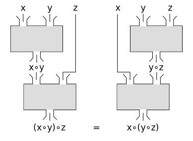

# 3. Categories and Functors

You probably already heard about such a thing as `Functor`. What is this actually? Before diving into it, let's talk a little about the basic theory.

## 3.1 Category

### 3.1.1 What is a category

In simple words, the definition of the category is quite simple, and you are already familiar with it - it's the `composition`! So, let's look up again what is a composition:

```
f: A -> B
g: B -> C

g∘f: A -> C
```

The `A` `B` and `C` are `objects` of the category (types in terms of TypeScript). While arrows `f` and `g` are `morphisms` (functions).

:::info
Objects in category theory have nothing in common with objects in OOP! It is more of an "entity" or just a "black box".
:::

So a category is a collection of `objects` and `morphisms`. And category has two basic properties: the ability to compose morphisms, and the existence of identity morphism. What is identity morphism? It's just an arrow which points to the object itself. `identity: A -> A`. Nothing more actually.


### 3.1.2 TypeScript as a category

A category can be interpreted as a simplified model of a **typed programming language** where:

* `objects` are **types** (like `string`, `number`, `boolean`)
* `morphisms` are **functions** (like `function length(a: string): number`)
* `∘` is the **function composition** (like `compose(length, duplicate)`)

So, what is this all about and why it might be interesting to us? Because this is the way how the programs are working in FP! All programs are just categories within which other categories are managed. Let's recall the initial explanation of what is the program: `manipulating the data`. And here, the `data` is **objects**, and `manipulative actions` is **morphisms**.

### 3.1.3 Properties of composition

The composition also has some properties, or rules, which are:

1. Associativity: `(f ∘ g) ∘ h = f ∘ (g ∘ h)`
2. Identity: `f ∘ identity = f`, where `identity: A -> A`

Associativity means that the order of composition doesn't matter. So, `f ∘ g ∘ h` is the same as `h ∘ g ∘ f`. And the identity means that the composition with the identity morphism doesn't change the morphism itself. So, `f ∘ identity = f`.

Associativity might seem complex, but it's very important to understand, here's a diagram which shows how it works:


And a simple example of associativity in TypeScript:

Try in the playground: [Listing 3.1.1 - Associativity example](https://www.typescriptlang.org/play?#code/GYVwdgxgLglg9mABBOBbADnAzgUwDwCCANIgEIkDCAfABQBGEAXIvc6QJSIC8ViFJAQzrMaA5gU48y7EWMQTuvCgG4AUKEiwEyNJlyES5PiQAitCABMRTPpN4mSDEcOmLjiIbPF3pX+T5M1DWh4JBQMbBwaADpY4DAscQAnJIEATzwY2IEkgHNE+RT0vAEwNKofUvLOAG9VREQknCgQJKRRZiqfGnqGxHisaKaLEAgcACUYXIALKB6+vtEICBJ4n3iliHYiXoWBHYX2XvY1AF81VVUUBKh+7hY5MBBUOhwkmUQsKCSYMFy3ATRKBwADK31+uRoJyuCC+iH+XBYLi+Pz+HzocDgABscKU3HRoji-lBpogAKSIABM3C4iIADGprnDSYiaDYMdjcWAPnTEAAfRAARjcEEQAH4hYhmAzLkzbsAZvdwnootMSMrIjRcqt2NC5fDpsAlbpNRrcDQ1fDtv1oTCEpzCXBIQrpjRBXTrTNgG6PScgA)

```ts title="Listing 3.1.1 - Associativity example"
const f = (a: number): string => a.toString();
const g = (b: string): boolean => b.length % 2 === 0;
const h = (c: boolean): 0 | 1 => c ? 1 : 0;

const fgh = compose(h, compose(g, f));
const ghf = compose(compose(h, g), f);

fgh(10) === ghf(10); // true
```

## 3.2 Functor

### 3.2.1 The problem

But the programs are not so simple, and we're not always dealing with ideal cases like: `f: A -> B; g: C -> D` where `B === C`. What if `B !== C`? How to deal with such a case? What if `B` is actually `F<B>`, where `F` is some type of constructor or another category?
Let's sum up everything above and imagine an example:

```ts title="Listing 3.2.1 - Composition example"
type A = number;
type B = string;
type C = boolean;

const f = (a: A): B => a.toString(); // convert number to string
const g = (b: B): C => b.length % 2 === 0; // is the string length an even number?

const gf = compose(g, f);

f(10) === '10';
g('10') === true;

gf(10) === true;
```

Here's everything all right. But what if `f` would return not a `B`, but `F<B>`?

:::warning
Keep in mind, the code below can't be compiled and contains an error. TypeScript does not support **Higher-Kind Types** (passing type constructors as `Array` to parameters or assigning it to variables). Detailed realization of some functions is omitted in favour of simplicity.
:::

```ts title="Listing 3.2.2 - Cannot create A -> C composition"
type A = number;
type B = string;
type C = boolean;
type F = Array // Unfortunately we cannot create an alias for generics (type constructors) 

const f = (a: A): F<B> => [a.toString()];
const g = (b: B): C => b.length % 2 === 0; // is the string length an even number?

const gf = compose(g, f); // Error! The returned object of "f" is not assignable to the input object of "g"!  
```

What can help us here? How can we make it work? Here's the `Functor` come in a game.

### 3.2.2 The solution

What do we need to do to make `Listing 3.1.2` work? The `g` morphism should be transformed from `g: B -> C` to `g: F<B> -> F<C>`. But how to do this? How to **map** one category to another?

This is what the `Functor` is about. It is a **mapping** between categories. It has a `map` operator, which allows it to perform such mapping.

```ts title="Listing 3.2.3 - Functor type class"
type Functor<Domain> = {
  map: <ObjectA, ObjectB>(
    f: (a: ObjectA) => ObjectB // Takes the morphism f: A -> B
  ) => (fa: Domain<ObjectA>) => Domain<ObjectB> // Returns a new morphism F<f>: F<A> -> F<B>
};
```

Try in the playground: [Listing 3.2.4 - Usage of Functor](https://www.typescriptlang.org/play?#code/GYVwdgxgLglg9mABBOBbADnAzgUwDwCCANIgEIkDCAfABQBGEAXIvc6QJSIC8ViFJAQzrMaA5gU48y7EWMQTuvCgG4AUKEiwEyNJlyES5PiQAitCABMRTPpN4mSDEcOmLjiIbPF3pX+T5M1DWh4JBQMbBwaADpY4DAscQAnJIEATzwY2IEkgHNE+RT0vAEwNKofUvLOAG9VREQknCgQJKRRZiqfGnqGxHisaKaLEAgcACUYXIALKB6+vtEICBJ4n3iliHYiXoWBHYX2XvY1AF81VVUAeivC1LTEAFoPRAAbGCwoRDhgRAA3ASvEA4LDXW4AASgaXQOBqADFwNA4ElCEVyqdVCgEl9glBkQQ0dxEHUGqgBOhmAYyLRgH4FFIOG4aMA5AT7oQKkzdv0BNEyehmZwbvIsIg0nAQIgYUlgDhoK8HgBrMBwADuJDZ6Q8ryaAgsD2mAlFAkQ-O+0oEeKSJCwcEQMC+qBwpVFUENX01DxgSAAUgBle3GxAIzTIxB0B4WHAskCvKAAQmOO3Olyxn36BCJHUQYBAqDoOCSMjuxU+SW9uV4UgA2ry8X6oOWwLkaOwALpqNNfXJZlxlivFuhwOCvZ1IKR0aKj5tuxAAUkQACZuFwuIgAAwXNMjnBTuAt4AEGgARnX20Q1YA5KfL22TpiELbR3uD4irZ6+eSaLl2DQrze7xIatG2BO9O0fHcX2ZN98TRT8BR-P9r3XS8SEvRcMNQxBLwAZiw69j0I29z2ApJgVWQFcAo14qMQECcDA1NH27Q8iXCPQolxWD7ng79z0Pe8HwSSDXn3b9DxPM8gPosCgA)

```ts title="Listing 3.2.4 - Usage of Functor, now we can create composition A -> F<C>"
type Functor<M> = {
  //          f: A -> B       map(f): F<A> -> F<B>
  map: <A, B>(f: (a: A) => B) => (fa: M<A>) => M<B>
};

// Array - a list of values
const functorArray: Functor<Array> = {
  map: <A, B>(f: (a: A) => B) => (fa: Array<A>) => (
    fa.map(f) // As you perfectly know, Array already has a map operator, so it means that Array in JS is a Functor by default!
  ),
};

const fA = (a: number): Array<string> => [a.toString()];
const g = (b: string): boolean => b.length % 2 === 0;

fA(10) === ['10'];
functorArray.map(g)(['10']) === [true];
functorArray.map(g)(['10', '222', '3', '1111']) === [true, false, false, true];

const gfA = compose(functorArray.map(g), fA);

gfA(10) === [true];
```

Let me make this more abstract:

```
# Our situation becomes more complex:
f: A -> F<B>
g: B -> C

# We cannot create a composition, because the output of `f` is not a `B` but `F<B>`
🛑 g ∘ f: A -> F<C>

# But how Functor can help us? The Functor basically makes from morphism A -> B a new morphism F<A> -> F<B>
F<g>: F<B> -> F<C>

# But we can create a composition with the help of Functor
✅ F<g> ∘ f: A -> F<C>
```

So, in our example above, we're creating a Functor for the `Array` type (more strictly say: `Functor` whose **domain** is the type `Array`). Then, we're creating two functions, `fA` and `g`, and then create our composition function with the help of the `Functor`. And it works! We can create Functor for any type, not only for `Array`. For example, for `Promise`:

Try in the playground: [Listing 3.2.5 - Functors for Task and Maybe](https://www.typescriptlang.org/play?jsx=0#code/GYVwdgxgLglg9mABBOBbADnAzgUwDwCCANIgEIkDCAfABQBGEAXIvc6QJSIC8ViFJAQzrMaA5gU48y7EWMQTuvCgG4AUKEiwEyNJlyES5PiQAitCABMRTPpN4mSDEcOmLjiIbPF3pX+T5M1DWh4JBQMbBwaADpY4DAscQAnJIEATzwY2IEkgHNE+RT0vAEwNKofUvLOAG9VREQknCgQJKRRZiqfGnqGxHisaKaLEAgcACUYXIALKB6+vtEICBJ4n3iliHYiXoWBHYX2XvY1AF81VRQEqERc7hYXLCgkmDBcmUQ6ODgAGxxStx0aJ-N5QaaIACkiAATNwuFxEAAGC4AegAVGj6mjEAB1HDIAECH5YODIJoCKD4uCtRBwADuSCgaXQOEEYAsZP+lI8iAAYuBoHAkv0hYgYFAAIRYxAAWXSdHxAFpEGD8QA3IkgfFgimIVBTWYsUoc-UzG5gOBQTgKxA4DBM2nCi1gHDRRAAGRgAGt8WAQD8fkI-iwAGqa-EAH0QfoDR0QaJRqlUTJZiAAymh8AReAiairmThmAByEmoHBFkgan5a8SIc7JguIAByCHxufzLOLzvLdbUKfxcrSCsIOfTmZHiCjLZdFyuTzFWAzZfuI5oqGYg+H2Y+qAXY7LE6kqGi-bhCJLmaLSZRKMQAAFTzV+ZohXhNzgqKdLgh58EoEL33uOoGlQAR0GYAwyFoYA-AUKQODcGhgDkd8R26XYFyXKJkM4AB+RBS2wpCBGiKstXYThmGQ44dnrb9rgIzMV2zDp-GYLDD14GhgMQMjCw8A4O34i8ywrVRThOej527ZhpzbRA837LtWyLXskznG5gBle5WL9VAFSSD5UKeF43hzXhCNEE84DTZ5XlyGgKNnH8blyLT7nCPRsIFf8knfaJQPQGh3lWGVJKk35XR+OAHIAImfQVhXfRhYqOOdIuBGKkJlGgAEZEW2RiyxoIt8qLJyIr+TKHL-AD5VdQLgvYGhLNKxFysKyznnIyT0qq6Kap8uqhwasCmpobtCsm5yEgygbgq0vKCpILqkh61FbwfRsnyGpI8AABSSNAYFwT8pM03aABUBCwL0gN6QKIOIKCkNgnwEKkYjmEO479G3RCMJvRAAEkkGQ6ASB+-VcD3V5xRgIkfjSHkEt8lVvkcHAIAEEAYfFRBphujwkDgFlUjR4BRUC9B7I8LBEDpHAAzpwpUmRwmsEB29gZuE7aTAJGCQDHAOVi1UwFisVrn+Dk4GARBYsC2KMOQk9phwMAkLjRBtnEmb5ygG67oRVc5Akb6juhrNzMQKGTtdJoSR+NUogEcKNP6fadLkPSDI+O39BM+ybcN26rP-WzTIcirztuYAvYRTzIiQq6jYCsaQs992fzmrL4t2xBrtulKjnjpb2DVjWaD6qKYs4IG2qLIJU9u9OgveGhQ69EqyooyvNZr6r69vbqcDUNz9vL-vq5z-q68QIHR+UIA)

```ts title="Listing 3.2.5 - Functors for Task and Maybe"
// @type {Functor<Promise>}
const functorTask = {
  map: <A, B>(f: (a: A) => B) => (fa: Promise<A>) => (
    // In fact, Promise is initially a Functor too, because it has an operator for mapping as well as Array has
    // It is only called "then" instead of "map"
    fa.then(f)
  ),
};

const task = <A>(a: A): Promise<A> => Promise.resolve(a);

const fP = (a: number): Promise<string> => task(a.toString());
const g = (b: string): boolean => b.length % 2 === 0;

const gfP = compose(functorTask.map(g), fP);

fP(10) === task('10');
functorTask.map(g)(task('10')) === task(true);

gfP(10) === task(true);

/**
 * We can also create our own type, and create a Functor for it!
 * Maybe - the value that might (and might not) be empty or none. Like nullable (Value | null)
 */

type Some<A> = { type: 'some', value: A };
type None = { type: 'none' };
type Maybe<A> = Some<A> | None;

const isSome = <A>(m: Maybe<A>): m is Some<A> => m.type === 'some'

const some = <A>(a: A): Some<A> => ({
  value: a,
  type: 'some',
});
const none: None = { type: 'none' };

// @type {Functor<Maybe>}
const functorMaybe = {
  map: <A, B>(f: (a: A) => B) => (fa: Maybe<A>) => (
    isSome(fa) ? some(f(fa.value)) : fa
  ),
};

const fM = (a: number): Maybe<string> => some(a.toString());

const gfM = compose(functorMaybe.map(g), fM);

fM(10) === some('10');
functorMaybe.map(g)(some('10')) === some(true);
functorMaybe.map(g)(none) === none;

gfM(10) === some(true);
```

It might look a little different from the way how we usually think about `map`. Why we're using our good old `map` for Promises or this strange "Maybe"!? Isn't it about iterating? Isn't it about making an `Array` of **usernames** from my `Array` of **User objects**? Yes and no.

To make it easier, there are actually two viewpoints on the `map`:

1. Morphism centric: something that makes from morphism of `f: A -> B` a new morphism of `F<f>: F<A> -> F<B>`
2. Functor centric: something that makes from functor `F<A>` a new functor `F<B>` using a morphism `f: A -> B`

Both are correct, but the second one is more practical for us because in programs data transformation is more well spread than function transformation.

## 3.3 Thinking in Functional programming way

The hardest part of learning new paradigms is to switch your mindset and way of thinking when you code. **We are learning how to code and think again**.

It is easy to say that functional programming is about **"what to do"** rather than **"how to do"**. But this difference is significant!

When we are starting to work with functional programming, one says to us: "Here's the `map` function. It is a functional way to iterate over an array, it accepts the callback as a parameter, this callback is applied to each value in the array, and returns a new array without modification of the previous one". And this explanation is fully correct! But here's the thing - this description is **imperative**. It sticks to the detail of how it behaves, not what it is for.

So, the `map` is for
`mapping`. For mapping the `F<A>` to `F<B>`, it doesn't matter if it is `Array<User>` to `Array<string>`, or `Promise<User>` to `Promise<string>`. The same operation, the same signature, the same **purpose**.

Let's look at another example. What is a `+` operator in terms of JavaScript? It is an operator of `addition`. When you see `2 + 3`, are you describing it as merging bits from right to left with the `&`? I guess not, we are saying that this is an addition.

And then, we see `'hello' + ' world'`. Is it the same operation? Yes! But is it behave similarly to `2 + 3`? Absolutely no, it has nothing in common with mathematical addition. Do you describe this operation as "creating a new string by filling it at the beginning with the chars of the first string, and then the second"? Also, no, just `addition` or `concatenation` of strings. And it seems quite natural to us. Even with the fact that this violates the base rule of addition - `associativity`.

```ts title="Listing 3.3.1 - We can easily think about such abstractions as an addition with different types"
5 + 3 === 3 + 5;

'hello' + ' world' !== ' world' + 'hello';
```

We just know the abstract meaning of the `+`. We can quite easily understand what the result this code would produce even without looking at the details:

```ts title="Listing 3.3.2 - Even with more complex types"
type Point = { x: number; y: number };

type add = (point1: Point, point2: Point) => Point;
point1 + point2; // add(point1, point2)
```

Or, when we are talking about `equality`, it is also quite easy to understand this code:

```ts title="Listing 3.3.3 - As well as equality"
type equals = (point1: Point, point2: Point) => boolean;

point1 === point2 // equals(point1, point2)
```

Quite easy, isn't it? Now you know what `Semigroup` (**addition**) and `Setoid` (**equals**) are! Congratulations! (details about it are in the next chapter).

That's it, the most important concept of functional programming - **abstraction**. You do not care what the actual data is. When you see that something is `Functor`, `Monad` or `Semigroup`, you already know what it does, without even looking at the code. **Why?**

:::info
Because as well as you don't need to think about how the computer handles the `5 + 3` or any other `+`, you shouldn't think about how `Array.map(f)` or any other `F.map` is working. **You just know what it does - mapping**
:::

## 3.3 Immutability

When we are talking about FP, we are always faced with the fact, that everything is **immutable**. But why?

Actually, it's obvious. We mentioned above that everything is an expression, and by chaining functions, our values are transformed. Just like the `10 * 2 + 5`, there is data (**objects**): `10`, `2`, `5`; and operations (**morphisms**): `*`, `+` (in such languages as `Haskell` mathematical operations are indeed functions, which can be carried and follow all other rules).

Do we need explicitly mention that for example `10` is immutable? Of course not! It's obvious! That's right, we can't even imagine how to mutate `10`, it is just a constant, it can't be anything but just the number **10**.

In functional programming, the same logic applies to every data unit, everything is a constant. Be this a number, asynchronous data, an array, or data that might have an error or be empty - everything is the same, treated in the same way, and subject to the same rules.
