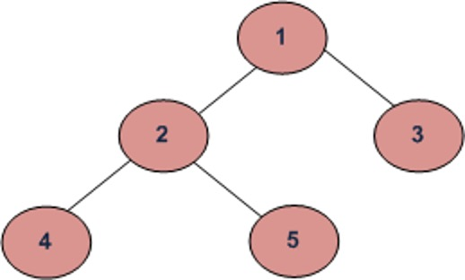
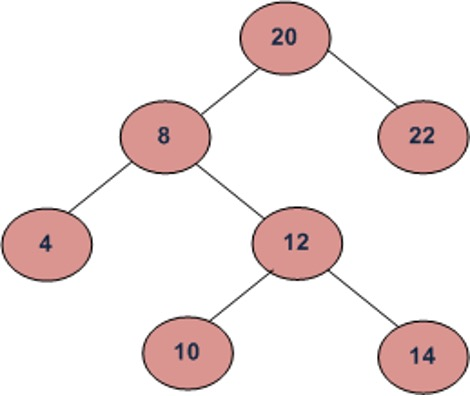
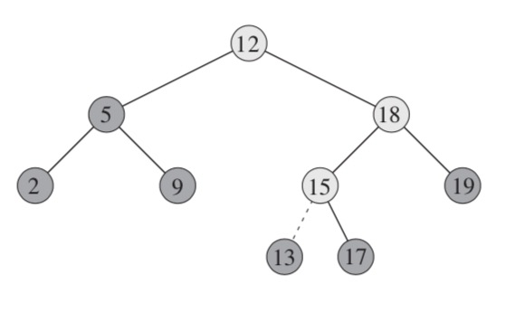

# 2. Binary Search Tree

This data structure is a bit more interesting. With this data structure it's easy to implement a set data type, which is a collection of unique elements. It's also easy to implement operations such as **search**, finding **min** or **max** element in the set and search of **previous** and **next** values. All those operations take `O(logn)` time if the tree is balanced.

Figure 2.1


On the Figure 2.1 you can see a balanced tree on the left and an unbalanced tree on the right. If the tree is balanced, the operations mentioned above will take `Ø(lgn)` where `Ø` - theta. If the tree is unbalanced, the operations will take `O(lgn)`.

**Binary Search Tree** (BST) is a node-based binary tree data structure which has the following properties:
- The left subtree of a node contains only nodes with keys smaller than the node's key.
- The right subtree of a node contains only nodes with keys bigger than the node's key.
- The left and right subtree each must also be a binary search tree or be `null`.

If a node is to be inserted into a tree, it is compared with current node (starting from the root). If the node's key is less than current, we send it down to left subtree. If node's key is greater than or equal to current - it is sent to the right subtree. This process is repeated for each encountered node. 

## 2.1 Tree Walks

The binary search tree property allows us to print out all the keys in a binary search tree in sorted order by a simple recursive algorithm, called an **inorder tree walk**. This algorithm is named so because it prints the key of the root of a subtree between printing the keys in its left subtree and printing those in its right subtree. (Similarly, a **preorder tree walk** prints the root before the values in either subtree, and a **postorder tree walk** prints the root after the values in its subtrees.)

```ts title="Listing 2.1 - inorderTreeWalk"
function inorderTreeWalk(node) {
  if (node) {
    inorderTreeWalk(node.left);
    console.log(node.key);
    inorderTreeWalk(node.right);
  }
}
```

Figure 2.2



For example, with a tree in Figure 2.2, those tree walks would give following results:
- Inorder (Left, Root, Right) : 4 2 5 1 3
- Preorder (Root, Left, Right) : 1 2 4 5 3
- Postorder (Left, Right, Root) : 4 5 2 3 1

## 2.2 Searching

Because of the BST properties, it's very easy to search for an element with a following function:

```ts title="Listing 2.2 - searchTree"
function searchTree(node, key) {
  if (node === null || key === node.key) {
    return node;
  }

  if (key < node.key) {
    return searchTree(node.left, key);
  }

  return searchTree(node.right, key);
}
```

We can always find an element in a binary search tree whose key is a minimum by following left child pointers from the root until we encounter a `null`. The search of a tree's maximum is a symmetric procedure:

```ts title="Listing 2.3 - treeMinimum and treeMaximum"
function treeMinimum(node) {
  while (node.left) {
    node = node.left;
  }

  return node;
}

function treeMaximum(node) {
  while (node.right) {
    node = node.right;
  }

  return node;
}
```

Given a node in a binary search tree, sometimes we need to find its successor in the sorted order determined by an inorder tree walk. If all keys are distinct, the successor of a node `x` is the node with the smallest key greater than `x.key`. The structure of a binary search tree allows us to determine the successor of a node without ever comparing keys. The following procedure returns the successor of a node `x` in a binary search tree if it exists, and `null` if `x` has the largest key in the tree:

```ts title="Listing 2.4 - getSuccessor"
function getSuccessor(node) {
  // If node has a right subtree, find the minimum node in it
  if (node.right) {
    return treeMinimum(node.right);
  }

  let tempNode = node.parent;

  // Traverse up til parent node is null (root is reached and starting node is max)
  // OR until current node is not the left node of parent (this means that the parent node is the successor)
  while (tempNode && node == tempNode.right) {
    node = tempNode;
    tempNode = tempNode.parent;
  }

  return tempNode;
}
```

Figure 2.3



For an example look at Figure 2.3. The inorder successor of 8 is 10, the inorder successor of 10 is 12 and inorder successor of 14 is 20.

## 2.3 Insert

To insert a new value `value` into a binary search tree `tree`, we use the function `insertNode`. It takes a node `node` for which: `node.key = value`, `node.left = null`, and `node.right = null`. It modifies `tree` and some attributes of `node` in such a way that it inserts `node` into an appropriate position in the tree.

```ts title="Listing 2.5 - insertNode"
function insertNode(tree, node) {
  let leafNode = tree.root;
  let leafNodeParent;

  while (leafNode) {
    leafNodeParent = leafNode;

    if (node.key < leafNode.key) {
      leafNode = leafNode.left;
    } else {
      leafNode = leafNode.right;
    }
  }

  node.parent = leafNodeParent;

  if (!leafNodeParent) {
    tree.root = node;
  } else if (node.key < leafNodeParent.key) {
    leafNodeParent.left = node;
  } else {
    leafNodeParent.right = node;
  }
}
```

Figure 2.4



In the Figure 2.4, we want to insert 13. We look at 12 and go right, we look at 18 and go left, for 15 we insert 13 into its left subtree.

## 2.4 Deletion

The overall strategy for deleting a node `z` from a binary search tree `tree` has three basic cases but, as we shall see, one of the cases is a bit tricky:
- If `z` has no children, then we simply remove it by modifying its parent to replace `z` with `null` as its child.
- If `z` has just one child, then we elevate that child to take `z`s position in the tree by modifying `z` parent to replace `z` by `z`s child.
- If `z` has two children, then we find `z` successor `y` — which must be in `z` right subtree — and have `y` take `z`s position in the tree. The rest of `z`s original right subtree becomes `y`s new right subtree, and `z`s left subtree becomes `y`s new left subtree. This case is the tricky one because, as we shall see, it matters whether `y` is `z`s right child. 

Figure 2.5


In the Figure 2.5, we are removing element 18. In this case, the node has no children, and we modify 20 and set its left subtree to `null`.

Figure 2.6


In the second case we are removing element 25. Since it has only one child - 30, we replace the 20's right subtree with 30.

Figure 2.5


In the third case, we are removing element 25. Node 25 has 2 children. To delete node 25 we need to find the inorder successor of 25 or the inorder predecessor of 25. In our example the inorder successor is node 30 and inorder predecessor is node 19. The inorder successor will be the minimum of the right subtree. The inorder predecessor is going to be the maximum of the left subtree. After replacing the node with found value, we must delete the replacing node.

To simplify the deletion procedure, first we define a `transplant` function that would allow us to replace one node with another.

```ts title="Listing 2.6 - transplant"
function transplant(tree, u, v) {
  if (u.parent) {
    tree.root = v
  } else if (u == u.parent.left) {
    u.parent.left = v
  } else {
    u.parent.right = v
  }

  if (v) {
    v.parent = u.parent;
  }
}
```

And then we define `deleteNode` function.

```ts title="Listing 2.7 - deleteNode"
function deleteNode(tree, z) {
  if (!z.left) {
    transplant(tree, z, z.right);
  } else if (!z.right) {
    transplant(tree, z, z.left);
  } else {
    let y = treeMinimum(z.right);

    if (y.parent != z) {
      transplant(tree, y, y.right);
      y.right = z.right;
      z.right.parent = y;
    }

    transplant(tree, z, y);
    y.left = z.left;
    y.left.parent = y;
  }
}
```
