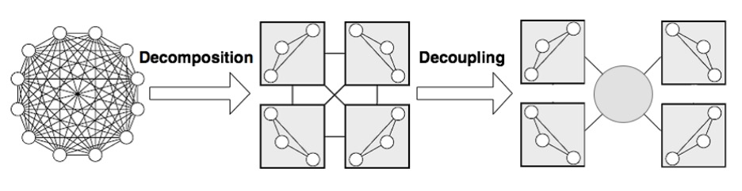

# 1. Introduction

Every program that needs to interact with a user requires a user interface. Through years of evolution of programming engineers learned some best practices represented in MV design patterns. Design patterns are reusable solutions to commonly occurring problems in software design.

This lecture discusses existing MV patterns classified in three main families: Model-View-Controller (MVC), Model-View-View Model (MVVM), and Model-View-Presenter (MVP). All of them are intended to address the needs of interactive applications by separating the concerns assigned to different components within their respective architectures. While similar, each of these patterns differs slightly in their motivations and applicability to various design goals.

## 1.1 Good Architecture vs Design Smells

Before we start talking about structural patterns, we need to clarify some important things about architectures because these patterns were created from analyzing of a vast number of different architectures and designed to build a good one.

So, what is a good architecture? How can we define that the architecture we are considering for our application is good or bad?

Analyzing the history of software development, we can say that good architecture allows us to edit, add or remove some features without being forced to change other modules or the entire system at all, so it can be done fast.

Basing on experience of thousands of developers and projects we can say that good architecture has these characteristics:
- Efficiency: all features have to work as it required and handle errors properly.
- Flexibility: the ability of software to change easily in response to different user and system requirements.
- Extensibility: the ability to add new functionality easily without need to update many other parts of application.
- Scalable development process: increasing the amount of developers does not require a change in the design.
- Testability: modules of your app should be easy to test.
- Reusability: your code does not have duplicates.
- Maintainability: well-structured, readable, and understandable code. Maintainability.

On the other hand, we have some characteristics which can describe bad architecture. They can be classified as code smells, as we discussed previously. When creating architecture, you have to avoid them:
- Rigidity: the design is hard to change.
- Fragility: The design is easy to break.
- Immobility: The design is hard to reuse.
- Viscosity: it is hard to do the right thing.
- Needless complexity: overdesign.

If you can describe you design with at least one of these points, you need to review it and possibly change it.

## 1.2 Why Do We Need Structural MV* Patterns?

In spite of all these characteristics the main thing about building architectures is reducing complexity. And to reduce complexity, nothing but division into parts has yet been invented. This is sometimes called the **divide et impera** principle, but essentially it is a hierarchical decomposition.

Although MV* patterns have quite a few differences between themselves, their goals are similar: to separate the UI code (View) from the logic code (Presenter, Controller, ViewModel, etc.) and data processing code (Model). This allows each of this pattern parts to be developed independently. For example, you can change the look and style of your application without affecting business logic and data. Also dividing your application into independent parts allows you to simplify writing tests by decreasing its dependencies. As it is shown in Figure 1.1, on the left we have an example of a system. Modules in this system do not have a clear separation between each other so changing even some small detail in one module may affect work of second one, and changing second module will break third one etc. This makes improvements to our app expensive and hard to do.

Figure 1.1

So, this is what MV* patterns offer: efficient way to decompose logic of applications with user interface(s).
