# 2. MVC

MVC is a first pattern we are going to look at. MVC separates the representation of the application domain (Model) from the display of the application's state (View) and user interaction control (Controller). Each of these components is designed to handle some aspects of your app. Model is responsible for handling your data and operating it. This is where the business logic of your application should go. View is what your users see and interact with. Last but not least, controller is a part which makes view and model communicate with each other. Splitting your app into these three parts allows you to reuse them or replace easily without changing other parts.

According to the [source](http://aspiringcraftsman.com/2007/08/25/interactive-application-architecture/):
> The MVC pattern was originally conceived in 1978-79 by Trygve Reenskaug and had the primary goal of providing an interface for users to manipulate multiple views of data as if working with real world entities. The pattern was first referred to as the Thing-Model-View-Editor before Reenskaug and his colleges settled on the name Model-View-Controller (1). A modified version of Dr. Reenskaug's design was later implemented as part of the Xerox PARC Smalltalk-80 class library. A description of this implementation can be found in the work: Applications Programming in Smalltalk-80(TM): How to use Model-View-Controller (MVC).

MVC became popular and a lot of sources about it exist now. The problem is, a lot of sources describe it in a wrong way, or oversimplify the pattern. This results in confusion between developers. In a more advanced version, MVC is called a composite pattern, that is, a combination of several patterns that work together to implement complex applications (usually Observer, Strategy and Composite are mentioned here). And only a few people understand that.

:::important

MVC is primarily a set of architectural ideas / principles / approaches that can be implemented in different ways using different patterns.

:::

## 2.1 Passive/Active Model

MVC schemas can be divided into two types: passive and active view (Figure 2.1). Your view needs to get the data from model, and it can be achieved in two ways. In first case view knows about model, and it gets the data directly from it. In second case, data from model is provided by controller so view knows nothing about the model, which makes it more modular. Crossed line between Controller and View on “Active View” schema means that this relation is not required.

Figure 2.1

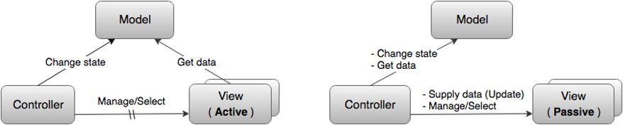

There can be several views - they can display the same data in different ways, for example, in the form of a table or a graph, or they can be responsible for displaying different parts of the data from the Model. The Controller is the most controversial component because it may take different functions like handling view events or be responsible for transferring data between View and Model. Nevertheless, it is common that the Controller is always aware of the Model and can change it (usually as a result of user actions). It can also manage the View / Views (especially if there are several of them) and accordingly know about the Views, but this is not necessary.

A model, like a View, can also be Passive or Active (Figure 2.2). The Passive Model has no effect on either the View or the Controller. In this case, all changes to the Model are monitored by the Controller, and it is also responsible for redrawing the View when necessary. 

Figure 2.2

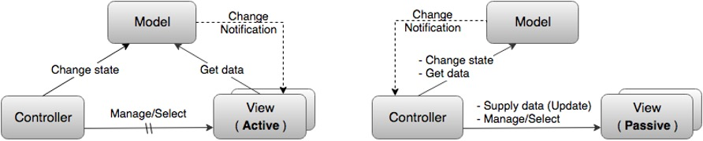

But usually, by MVC they mean the variant with the Active Model. The "Active Model" notifies that changes have occurred in it. And it does this through the Observer template, sending notifications of changes to all its "subscribers". The "Active View" subscribes to these messages itself and thus knows when to re-read the data it needs from the model and update itself. In the case of a Passive View, the Subscriber is the Controller, which then updates the View. The Observer pattern allows the Model, on the one hand, to inform the View or the Controller that changes have occurred in it, and on the other hand, in fact, "not know" anything about them (except that they implement a certain specified "subscriber" interface) and thus remain independent. This is called loose coupling and is considered the second key point of MVC.

## 2.2 User Interaction with the View

As we already know, MVC is a pattern for development of applications with user interface, so it means that on out schema user is presented always. User interacts with the application and calls some model's functions by this interaction.

Figure 2.3

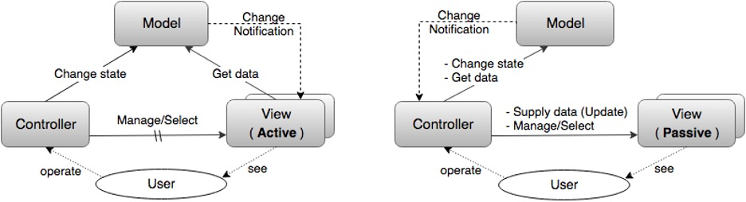

In first scheme (Figure 2.3) the user controls the application through the Controller, and the View serves solely to display information about the Model, and the user only sees it. In this case by View we can some HTML template engine for example.

Figure 2.4

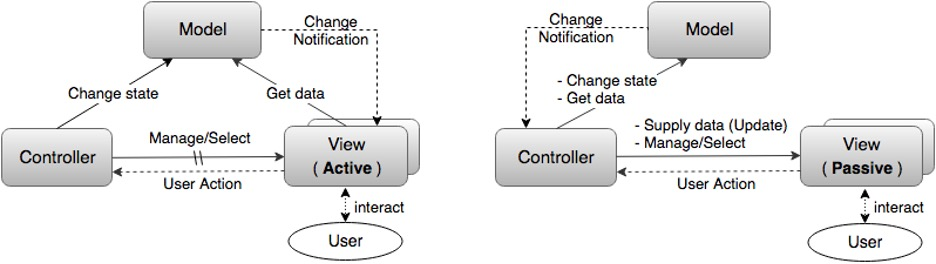

In second one (Figure 2.4) the user controls the application through the View that receives user commands and transfers them to the Controller. In this case, another connection is formed between the View and the Controller:

- **direct** (the View knows about the Controller and directly transmits information) or, most often.
- **weakened** (the View simply sends information about user actions to all interested subscribers and the Controller subscribes to this mailing).

## 2.3 MVC in Web

MVC is commonly used in Web development. In context of it we can say that Model can be represented by database. Your web server which is interpreted as Controller. Sometimes it is also said that the controller is the center for processing all requests and making decisions, as well as an intermediate layer that provides communication between the model and the view. View is the user interface. Moreover, the interface in this case, as a rule, is understood exclusively as "design", just a set of graphic elements.

Let us check every component usage in Web development. This way of mapping MVC to Web is simplified too much, and we will discuss it in next section.

## 2.3.1 Model

The Model is responsible for getting and manipulating the data, so it is the brain of the application. Usually, it interacts with some kind of database. This could be a relational database, like MySQL, or a NoSQL database like a MongoDB. It really does not matter and in many frameworks that support multiple databases, the model code will stay the exact same.

It is just the database driver that needs to change, and it does not even have to be a database that works with it. It could be a simple file. So, you could just have your model interact with a JSON file and pull data from that.

## 2.3.2 View

Next, we have the view, and you can guess what that takes care of. That is the actual view of the application, so it is user interface, it is what the user sees and how they interact with the application.

So in web, the view usually consists of HTML and CSS along with dynamic values from the controller. So, the controller communicates with the view as well as the model. Now, depending on which framework you use, the template engine may vary.

The template engine is what allows dynamic data. If we have straight HTML, we cannot output variables, we cannot use logic, select an if statement, etc., but, with template engines, we can do that stuff right in the view or right in the template.

So, some examples of template engines would be Handlebars.js and Dust.js. Then, for Ruby on Rails, we have ERB, which is embedded. For Ruby, you can also use Haml and then with Python you have a Flask. There is a lot more of them out there and some do more than others, but you have a lot to choose from, especially with JavaScript.

## 2.3.3 Controller

So, finally, we have the controller and the controller takes in user input, so this could be from the user visiting a page or clicking a link which makes a get request or submitting a form which makes a _POST_ request, and we also have _DELETE_ requests or _PUT_ requests for updating. And these cannot be made directly from the browser, you can only do a get or a post, but we do have HTTP clients that are at times built in with the framework, that can do that.

Now the controller acts as kind of agent between the model and the view. The controller will ask the model to get some data from a database and then the controller will take that data, load a view, and pass that data into it. Then, from there, the template engine takes over and can do some logic, output variables, and things like that.

The controller can also load a view without passing it data, so just a plain web page with HTML and CSS, no actual templating logic.

Figure 2.5

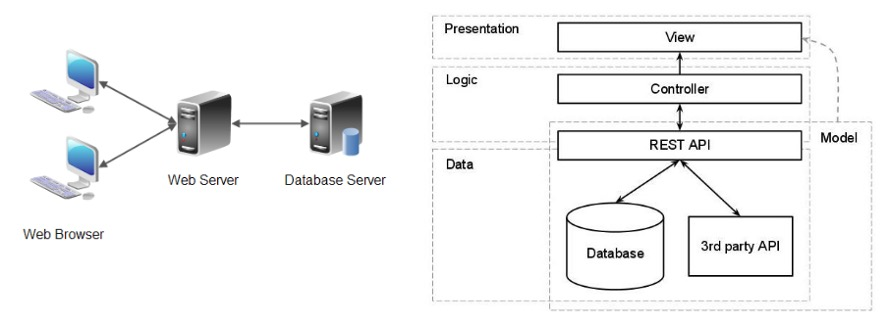

## 2.4 MVC in Architecture

The way of thinking understanding MVC from previous section might work, but it’s not entirely correct because:
- **Model independence is central to MVC**. If the Model is thin, that is, it contains only data, then the possibility of its independent development makes little sense. Accordingly, with this approach, MVC itself loses its meaning.
- All the business logic of the application, that is, most of the code, is concentrated in the Controller, and this is despite the fact that **the Controller is the most dependent part in MVC** - in general, it depends on both the Model and the View. In well-designed applications, they try to do exactly the opposite - the most dependent parts should be minimal, not maximal.
- Since, as a rule, not only the Model is thin, but also the View is thin (Dumb GUI, Dumb View), then, as a result, in addition to all the business logic of the application, the controller also places the logic for managing the user interface. That is, instead of separating business logic and presentation logic, this approach results in their mixing.

So, it is better to take MVC not like a pattern, but a set of architectural principles and ideas used in the construction of custom information systems (usually complex). The essence of such principles is as follows: **a complex system must be divided into modules**. Moreover, it is advisable to do the decomposition hierarchically, and the modules into which the system is divided should be, if possible, independent, or weakly coupled (Low coupling), just like it is shown on example on Figure 2.6. All presented modules are separated from each other, so it is easier to test them and develop independently.

Figure 2.6

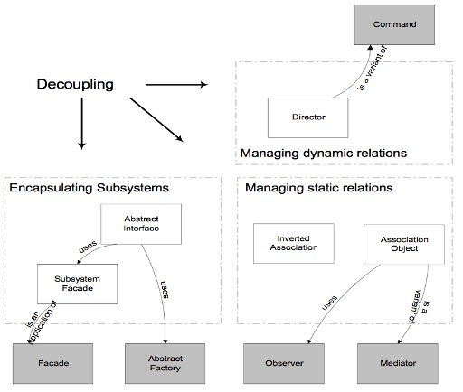

Basically, MVC is based on three simple ideas:
- **Separate Model and UI into modules**

  Figure 2.7

  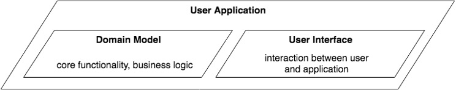

- **Decouple Model and UI**. Independent Models and User Interface synchronized via Observer pattern. This allows Model to be independent and know nothing about its subscribers.

  Figure 2.8

  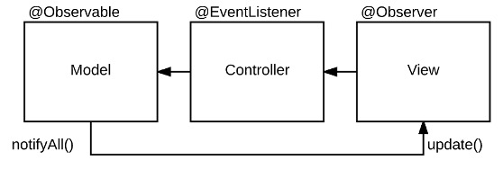

- **Separate UI into View and Controller**
  Figure 2.9

  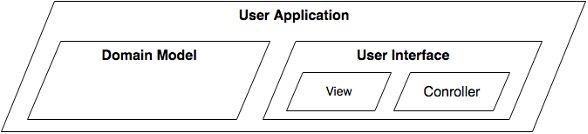

Looking at architecture of your application in this way allows you to split development of your app into separate parts and scale or change them easily when needed.

## 2.5 Original Reenskaug's Scheme

In general, is the Model one object or multiple objects? And is the Model in the "MVC Scheme" really the same as the domain model that describes the domain and business logic of the application? When it was said that the system should be divided into modules that are loosely connected to each other, we did not mention the main rule - modules should interact with each other only at the level of abstract interfaces (Dependency Inversion Principle). A module interface is usually implemented by a special object - Facade. Thus, the key idea of MVC is really that the user application is divided into two modules - one of which models the domain and implements business logic (domain model), and the second is responsible for user interaction (user interface). But at the same time, the Model in the "MVC scheme" is not at all identical to the domain model (which can be arbitrarily complex and consist of many objects), but is just its interface and facade.

Figure 2.10

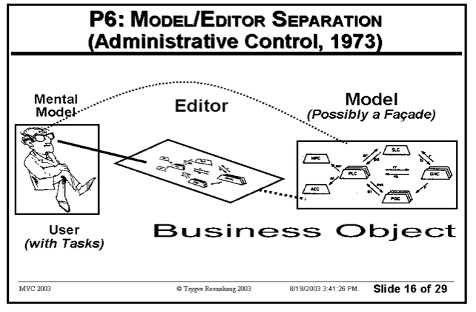

Figure 2.10 is a slide from original Reenskaug's presentation. Check out the text in parentheses "Possibly a Façade". So, it does not matter for the MVC is our Model is a real domain model or just a façade which encapsulates more complex logic.

## 2.6 Domain Model Facade. Provider Dictates Interface

Traditionally, in client-server applications, the server is considered the main one. He provides services and decides in what form it should be implemented. So, the interface and facade are usually defined from the server's point of view. And clients adapt to this specified format.

Figure 2.11

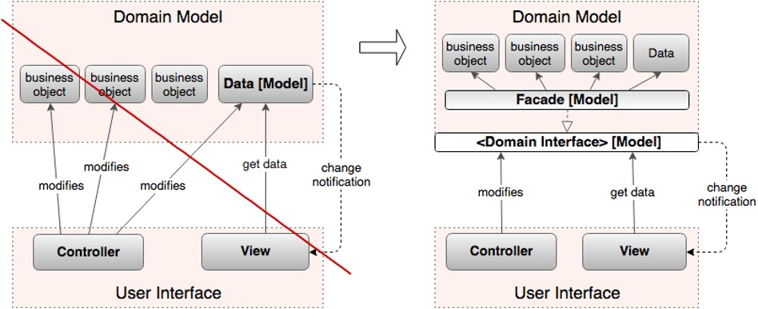

In practice, it is not a server-oriented architecture that is more adequate, but a client-oriented one. The client-centric approach is much better suited to the Interface Segregation Principle, as it uses many thin Required Interfaces instead of one thick Provided Interface.

Due to the fact that the facade present in the original MVC has been "lost", its role is often taken over by the Controller. This is the origin of the idea that the Controller is "between the Model and the View", serves as a glue between them and provides the data the View needs.

Figure 2.12

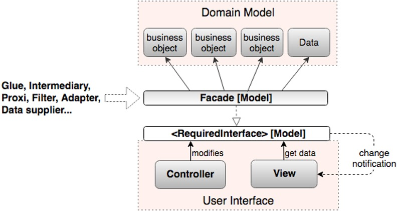

## 2.7 How to Apply

Now we can check how MVC can be implemented with some programming language, Typescript in our case.


Figure 2.13

As usual, we have three main components: Model, View and Controller.

Model (domain model in our case) contains data and some methods to interact with it. In our case this data is stored in some database. But keep in mind that data can have different origins like some API’s or other services.

View is a layer of displaying data on customer's screen. Without any logic, usually provided by frameworks like Angular, Vue or done via HTML-templates. In our case it is an HTML DOM tree.

Controller handles user interactions with View and updates Model and View. It is responsible for making decisions like what data and when should be updated or whether it needs to be updated at all.

```ts title="Listing 2.1"
class Controller {
  constructor (private readonly view: IView) {}

  public async initialize() {
    const response = await getResponseFromSomewhere();

    if (Number.isInteger(response.personId)) {
      this.showPerson(response.personId);
    } else {
      this.showError('The ID was missing.');
    }
  }

  private showPerson(id: number): void {
    const repository = new Repository();
    const model = repository.getModel(id);

    this.view.showPerson(model);
  }

  private showError(error: string): void {
    this.view.showError(error);
  }
}
```

It should be noted that the `Controller` receives input events directly and not through the View. The controller interprets user input from the keyboard or mouse, and sends commands to the model and view to make the appropriate changes.

## 2.8 Summary

So, what advantages MVC gives us?
- First it is easier overall maintenance. When updates need to be made to the application it is clear whether the changes are data-centric, meaning changes to models and controllers, or merely visual, meaning changes to views.
- Decoupling of models and views means that it is significantly more straight-forward to write unit tests for business logic.
- Duplication of low-level model and controller code (i.e., what we may have been using instead) is eliminated across the application.
- Depending on the size of the application and separation of roles, this modularity allows developers responsible for core logic and developers working on the user interfaces to work in parallel.

Today's development environments have come a long way in shielding developers from such complexities, making divisions between device input and output at the application level unnecessary. Within many development environments, the original goals of the Model-View-Controller pattern can be carried out today by merely separating an application’s Forms and associated Controls from its domain model.
