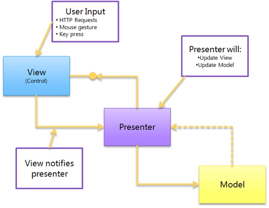

# 3. MVP

MVP (Model-View-Presenter) is a product of evolution of MVC. In previously discussed pattern View is responsible only for displaying data and Controller handles all of View’s interactions and events. During the development of Web, we have some elements which can handle events and user input by itself. Now controller does not need to be responsible for handling of these operations and here we have Presenter. In fact, MVP is a more modern way of building apps with user interfaces.

## 3.1 P for Presenter

In fact, Presenter is the business logic component for the View. Unlike MVC, calls from the View are delegated to the Presenter, which is separate from the View and communicates with it through an interface.



Figure 3.1

In the MVP we have three components:
- **Model**. This is the data of your application, the logic of their receipt and storage. Often it is based on a database or on the results from web services. In some cases, you will need to adapt, modify or expand it before using it in View.
- **View**. Usually it is a form with widgets. The events of View should be sent to the presenter.
- **Presenter**. The presenter contains all the user interface logic and is responsible for synchronizing the model and the view. When the view notifies presenter that the user interacts with the system (for example, presses a button), the presenter decides to update the model and synchronizes all changes between the model and the view.

## 3.2 Passive View

There are two types of this pattern: Passive View and Supervising Controller.

In Passive view MVP variant, the view knows nothing about the model, but instead provides simple properties for all the information that needs to be displayed on the screen. The presenter will read information from the model and update properties in the View.

Models can trigger events; Presenters can subscribe to them if they wish to update the View. In this passive architecture, we do not have the concept of direct data binding. Views provide setters that Presenters can use to set data.

```ts title="Listing 3.1"
class PersonalDataView implements IPersonalDataView {
  get userName(): string {
    const input: HTMLInputElement = document.getElementById('userInput');

    return input.value;
  }

  set userName(value: string) {
    const input: HTMLInputElement = document.getElementById('userInput');

    input.value = value;
  }
}
```

The benefit of this change from MVC is that it improves the testability of our application and provides a clearer separation between view and model.

While a typical Passive View implementation involves implementing an interface with setters and getters, there are options that involve the use of events that can unbind the Presenter View.

## 3.3 Supervising Controller

In this MVP variant, the view is aware of the model and is responsible for binding data to the display. This makes the communication between the Presenter and the View more concise.

```ts title="Listing 3.2"
class PersonalDataView implements IPersonalDataView {
  public setPersonalData(data: PersonalData): void {
    const input: HTMLInputElement = document.getElementById('userInput');

    input.value = data.firstName;
  }

  public updatePersonalData(data: PersonalData): void {
    const input: HTMLInputElement = document.getElementById('userInput');

    data.firstName = input.value;
  }
}
```

## 3.4 Summary

So, what does MVP gives us?
It makes debugging easier in Applications. MVP enforces three different layers of abstractions which makes it easier to debug your applications. Moreover, since business logic is completely decoupled from View, it is easier to perform unit testing while developing your application.

Also, it enforces better separation of Concerns. MVP does an excellent job of separating out your business logic and persistence logic out of your classes which in turn better enforce good separation of concerns.

And finally, it improves code re-usability. In MVP, the code can be better reused since you can have multiple presenters controlling your Views. This is more important as you do not want to rely on a single presenter to control your different Views.
