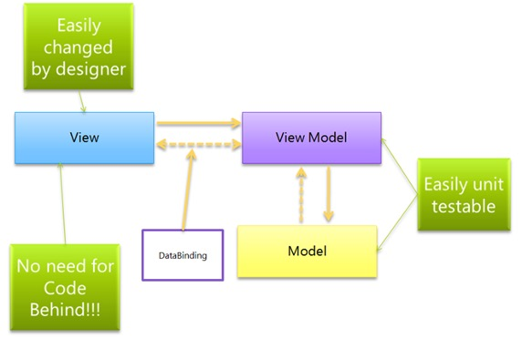

# 4. MVVM

MVVM stands for Model-View-ViewModel. From one point of view, it can be considered as evolution of MVC, but from another it is fair to say that MVVM is fundamentally different. It was implemented in 2005 by John Grossman. The main idea behind this pattern is that it is trying to fully separate development of view and UI from development of Model and business logic.



Figure 4.1

## 4.1 Model

```ts title="Listing 4.1 - Model"
const Todo = function (content, done) {
  this.content = ko.observable(content);
  this.done = ko.observable(done);
  this.editing = ko.observable(false);
}
```

The ViewModel cannot communicate with the View directly. Instead, it presents easily bindable properties and methods as commands. The View can bind to these properties to get information from the ViewModel and call commands (methods) on it. This does not require the View to be aware of the ViewModel.

As with other members of the MV* family, a model in MVVM represents data or domain information that our application will work with.

## 4.2 View

```ts title="Listing 4.2 - View"
const aViewModel = {
  contactName: ko.observable('John')
}

const template = `
  <input id="source" data-bind="value: contactName, valueUpdate: "keyup" />
  
  <div data-bind="visible: contactName().length > 10">
    You have a really long name!
  </div>
`
```

As with MVC, the View is the only part of the application that users interact with. This is some kind of interactive interface that represents the state of the ViewModel.

The Active View in MVVM contains databindings, events and behavior, and this requires an understanding of the ViewModel. The View is still responsible for handling events from the ViewModel here.

It is important to remember that the View is not responsible for the state, it just synchronizes with the ViewModel.

## 4.3 View-Model

The ViewModel can be thought of as a specialized controller that acts as a data converter. It converts model data to View data by passing commands from View to Model.

The ViewModel can also provide methods to help maintain the state of the View, update the model based on actions from the View, and trigger events on the View.

As a result, the ViewModel is behind the UI layer. It provides the data from the model that the View needs, and can be thought of as the source that the Views access for both data and actions.

```ts title="Listing 4.3 - View-Model"
const ViewModel = function (todos) {
  // map array of passed in todos to and observableArray of Todo objects
  this.todos = ko.observableArray(
    todos.map(todo => new Todo(todo.content, todo.done))
  );

  // store the new todo value being entered
  this.current = ko.observable();

  // add a new todo, when enter key is pressed
  this.add = (data, event) => {
    this.todos.push(new Todo(this.current));
  }
}
```

## 4.4 Summary

MVVM facilitates easier parallel development of a UI and the building blocks that power it.

MVVM abstracts the View and thus reduces the quantity of business logic (or glue) required in the code behind it.
The ViewModel can be easier to unit test than in the case of event-driven code.

The ViewModel (being more Model than View) can be tested without concerns of UI automation and interaction.

Table bellow shows the difference between MVC, MVP, and MVVM design patterns:

| MVC | MVP | MVVM |
| --- | ---| --- |
| One of the oldest software architectures | Developed as the second iteration of software architecture which is advance from MVC. | Industry-recognized architecture pattern for applications. |
| UI(View) and data-access mechanism (Model) are tightly coupled. | It resolves the problem of having a dependent View by using Presenter as a communication channel between Model and View. | This architecture pattern is more event-driven as it uses data binding and thus makes easy separation of core business logic from the View. |
| Controller and View exist with the one-to-many relationship. One Controller can select a different View based upon required operation. | The View has references to the Presenter. | The View has references to the ViewModel. |
| Difficult to make changes and modify the app features as the code layers are tightly coupled. | Code layers are loosely coupled, and thus it is easy to carry out modifications/changes in the application code. | Easy to make changes in the application. However, if data binding logic is too complex, it will be a little harder to debug the application. |
| User Inputs are handled by the Controller. | The View is the entry point to the Application. | The View takes the input from the user and acts as the entry point of the application. |
| Ideal for small scale projects only. | Ideal for simple and complex applications. | Not ideal for small scale projects. |
| Limited support to Unit testing. | Easy to carry out Unit testing but a tight bond of View and Presenter can make it slightly difficult. | Unit testability is highest in this architecture. |
| It does not follow the modular and single responsibility principle. | Follows modular and single responsibility principle. | Follows modular and single responsibility. |
